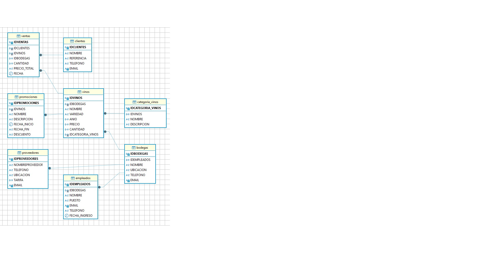

PROYECTO SQL 

 

 Introducción: descripción de la base de datos 

La APP fue creada para abarcar distintas bodegas de vinos en todo el territorio argentino para que cualquier persona pueda acceder a la ubicación de diferentes bodegas y obtener determinada información.  Se le asignaron varias operaciones para poder facilitar el acceso a datos y tener un control general sobre ventas, personal asignado, entre otros. 
 

Objetivo: 

Diseñar e implementar una base de datos relacional que pueda facilitar al usuario la manera de poder obtener información detallada sobre las ventas realizadas, tener una buena gestión sobre el personal asignado y poder llevar un registro sobre las ventas realizadas. 


Situación problemática: 

Se vio en la necesidad crear una base de datos que pueda agilizar algunas operaciones para poder ayudar al cliente en tener un registro detallado sobre el desempeño de su emprendimiento y ayudar a los usuarios que accedan a la APP para que puedan tener la ubicación de las bodegas en todo el territorio argentino y alguna información que el cliente vea pertinente que el usuario pueda acceder. 


Resolución de la problemática: 

Se dispuso crear e implementar una base de datos que aporte una solución al cliente sobre la problemática planteada. En respuesta, se procedió a la elaboración de dicha base de datos en la cual se priorizo a que sea eficaz y que pueda proporcionar información detallada de varios ítems tanto para el cliente como para el usuario. Por este motivo, se procedió a realizar un esquema que muestre registros sobre las ventas realizadas, registro detallado sobre el stock disponible, tener acceso a la ubicación de cada bodega, etc. 


Diagrama de entidad relación de la DB:




Descripción de la base de datos: 

Base de datos diseñada para mostrar la ubicación de las bodegas y obtener determinada información sobre dichas bodegas y poder realizar operaciones detalladas.

Tablas
```
BODEGAS 
```
Contiene información sobre las bodegas. 

Atributos: IDBODEGAS, IDEMPLEADOS, NOMBRE, UBICACION, TELEFONO, EMAIL. 
```
PROVEEDORES 
```
Contiene información de contacto sobre los proveedores. 

Atributos: IDPROVEEDORES, NOMBREPROVEEDOR, TELEFONO, UBICACION, TARIFA, EMAIL. 
```
CLIENTES 
```
Contiene información sobre el cliente y una referencia. 

Atributos: IDCLIENTES, NOMBRE, REFERENCIA, TELEFONO, EMAIL. 
```
CATEGORIA_VINOS 
```
Contiene la categoría de vinos y una breve descripción. 

Atributos: IDCATEGORIA_VINOS, IDVINOS, NOMBRE, DESCRIPCION. 
```
VINOS 
```
Contiene información sobre los vinos y la variedad. 

Atributos: IDVINOS, IDBODEGAS, NOMBRE, VARIEDAD, ANIO, PRECIO, CANTIDAD, IDCATEGORIA_VINOS. 
```
EMPLEADOS 
```
Contiene información completa sobre los empleados. 

Atributos: IDEMPLEADOS, IDBODEGAS, NOMBRE, PUESTO, EMAIL, TELEFONO, FECHA_INGRESO. 
```
PROMOCIONES 
```
Contiene información sobre las promociones vigentes y su descuento. 

Atributos: IDPROMOCIONES, IDVINOS, NOMBRE, DESCRIPCION, FECHA_INICIO, FECHA_FIN, DESCUENTO. 
```
VENTAS 
```
Contiene información detalla de las ventas realizadas a cada cliente. 

Atributos: IDVENTAS, IDCLIENTES, IDVINOS, IDBODEGAS, CANTIDAD, PRECIO_TOTAL, FECHA. 


Listado De Las Tablas Con La Descripcion De Su Estructura.

Tabla De BODEGAS


Tabla PROVEEDORES 


Tabla CLIENTES


Tabla VINOS


Tabla VENTAS


Tabla EMPLEADOS


Tabla De CATEGORIA_VINOS


Tabla De PROMOCIONES


## como correr mi codigo

```bash
  make
``` 
